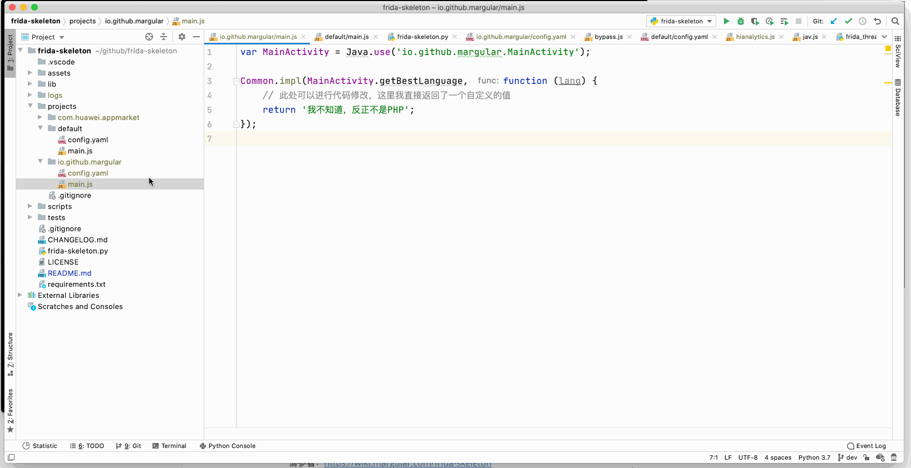
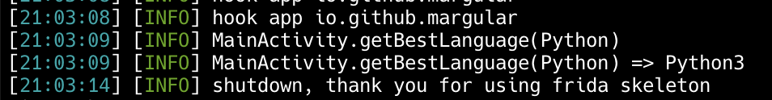

## 一句话简介

frida-skeleton会根据指定的正则表达式持续监听并hook对应的程序，遍历scripts目录下的所有js文件并将它们全部加载用以hook这些程序




## 使用示例

你可以在这里获取示例中的apk：[示例APK](https://github.com/Margular/frida-skeleton/releases)

[](https://asciinema.org/a/334653)


## 特性

### 更简洁的hook代码

原生frida的hook代码：

```javascript
var MainActivity = Java.use("io.github.margular.MainActivity");

MainActivity.getBestLanguage.implementation = function (lang) {
    var sendString = Date();
    sendString += " MainActivity.getBestLanguage(" + lang + ")";
    send(sendString);

    var bestLang = this.getBestLanguage(lang);
    bestLang = "Python3";
    sendString += " => " + bestLang;
    send(sendString);

    return bestLang;
}
```


frida-skeleton的hook代码(路径为`scripts/main.js`)：

```javascript
var MainActivity = Java.use('io.github.margular.MainActivity');

Common.impl(MainActivity.getBestLanguage, function (lang) {
    // 此处可以进行代码修改，这里我直接返回了一个自定义的值
    return 'Python3';
});
```


它们的输出相同，frida-skeleton通过实现一个Common.impl使得它会在hook函数的之前、之后都自动地打印日志信息，如下图所示：




# 更多特性

请参看：https://wiki.margular.com/frida-skeleton

