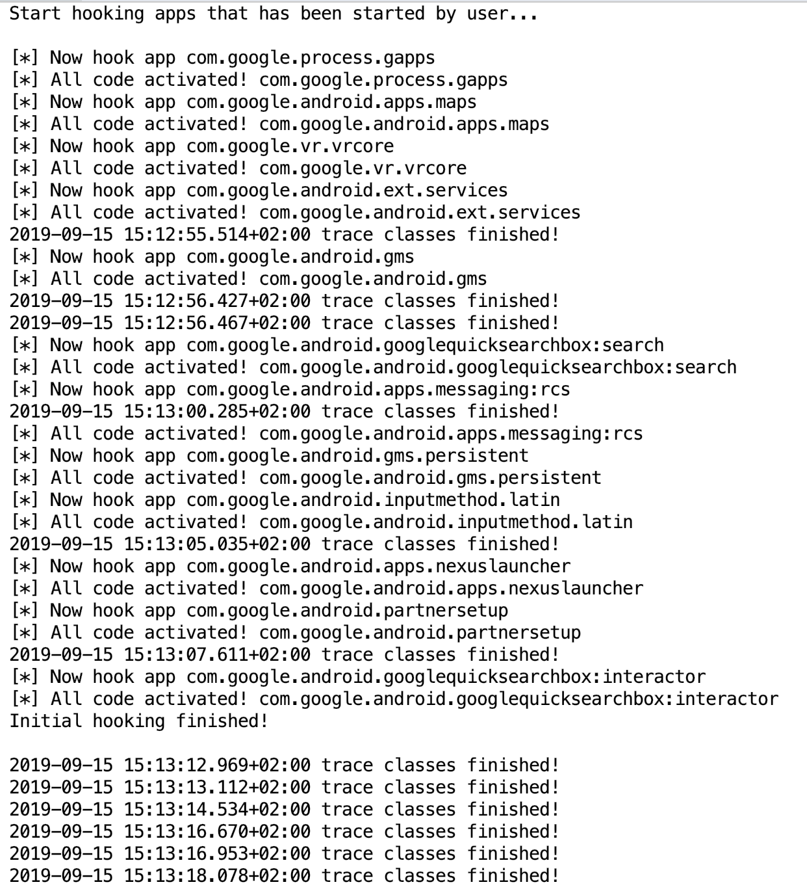

# frida-skeleton
This repository is supposed to define infrastructure of frida on hook android including some useful functions


## Requirements

Python3

Frida


## Usage

The command below will hook all applications whose package name starts with `com.google` or `com.twitter`, and keep monitoring these applications, hook them immediately when they start up

`Python hook.py "^com\.google\." "^com\.twitter\."`


Output:




## Features

You can get the [example apk](https://github.com/Margular/frida-skeleton/releases)

### Easy to write code

Old style of hooking like below:

```javascript
var MainActivity = Java.use("io.github.margular.MainActivity");

MainActivity.getBestLanguage.implementation = function (lang) {
    var sendString = Date();
    sendString += " MainActivity.getBestLanguage(" + lang + ")";
    send(sendString);

    var bestLang = this.getBestLanguage(lang);
    bestLang = "Python3";
    sendString += " => " + bestLang;
    send(sendString);

    return bestLang;
}
```


New style of Frida-skeleton:

```javascript
var MainActivity = Java.use("io.github.margular.MainActivity");

function getBestLanguage(lang){
    return this.getBestLanguage("I don't know, but it's not PHP!!!");
};

ImplementationWrapper("MainActivity.getBestLanguage", getBestLanguage);
```


They have the same output:

```
Start hooking apps that has been started by user...

[*] Now hook app io.github.margular
[*] All code activated! io.github.margular
Initial hooking finished!

2019-09-15 15:23:41.654+02:00 trace classes finished!
2019-09-15 15:23:44.827+02:00 MainActivity.getBestLanguage(Python)
2019-09-15 15:23:44.827+02:00 MainActivity.getBestLanguage(Python) => Python3
```


## Bypass SSL problem automatically

Now support:

* universal android ssl pinning bypass
* webview bypass


## Trace Java classes

There are two ways to trace java classes:

1. specify several classes to trace:

```javascript
[
	'java.io.File',
	'java.net.Socket'
].forEach(traceClass);
```

This will trace all methods of java.io.File and java.net.Socket


2. trace using regular expression

```javascript
Java.enumerateLoadedClasses({
  "onMatch": function(className){
    if (className.match(/^com\.google\./g)) {
      traceClass(className);
    }
  },
  "onComplete": function() {
    send(Date() + " trace classes finished!");
  }
});
```

This will trace all methods of all classes that the class name starts with com.google


You can edit the autorun.js directly!


## Trace JNI functions

```
[
	'libcommon.so',
].forEach(function (mName) {
```


This will trace all functions of libcommon.so


You can edit the autorun.js directly!


## Good Extensibility

You can copy your third party js file to `scripts/thirdparty` directly. In fact, the bypass features just copy the open source code to the directory.

